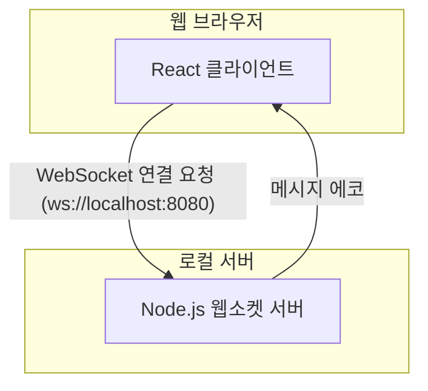

# Talkbox

간단한 웹소켓 기반의 실시간 통신을 테스트하기 위한 프로젝트입니다.

## 🚀 시작하기

이 섹션에서는 프로젝트를 로컬 환경에 설정하고 실행하는 방법을 안내합니다.

### 사전 요구 사항

- [Node.js](https://nodejs.org/ko) (LTS 버전 권장)
- [npm](https://www.npmjs.com/) (보통 Node.js 설치 시 함께 설치됩니다)

### 설치

1.  **Git 리포지토리 복제**

    ```bash
    git clone https://github.com/{your-username}/talkbox.git
    ```

    (참고: 위 URL은 예시이며, 실제 프로젝트의 URL로 변경해주세요.)

2.  **프로젝트 디렉토리로 이동**

    ```bash
    cd talkbox
    ```

3.  **의존성 패키지 설치**
    ```bash
    npm install
    ```

## ⚙️ 사용법

이 애플리케이션을 실행하려면 **웹소켓 서버**와 **클라이언트(React 앱)**를 각각 별도의 터미널에서 실행해야 합니다.

### 1. 웹소켓 서버 실행하기

첫 번째 터미널을 열고, 다음 명령어를 입력하여 웹소켓 서버를 시작합니다.

```bash
node src/server.js
```

이 명령어는 `ws://localhost:8080` 주소에서 웹소켓 서버를 실행합니다. 서버가 성공적으로 시작되면 터미널에는 별다른 메시지가 출력되지 않으며, 클라이언트의 연결을 기다리는 상태가 됩니다.

### 2. 클라이언트 애플리케이션 실행하기

두 번째 터미널을 열고, 다음 명령어를 입력하여 React 개발 서버를 시작합니다.

```bash
npm run dev
```

이 명령어는 Vite 개발 서버를 실행하며, 보통 `http://localhost:5173` 주소로 브라우저에서 애플리케이션이 자동으로 열립니다. (만약 5173 포트가 사용 중이라면 다른 포트로 열릴 수 있습니다.)

이제 브라우저의 개발자 도구(F12)를 열어 콘솔 탭을 확인하면, 웹소켓 서버와의 연결 상태 및 메시지 로그를 확인할 수 있습니다.

## 🏛️ 아키텍처

이 프로젝트의 간단한 구조는 다음과 같습니다.


